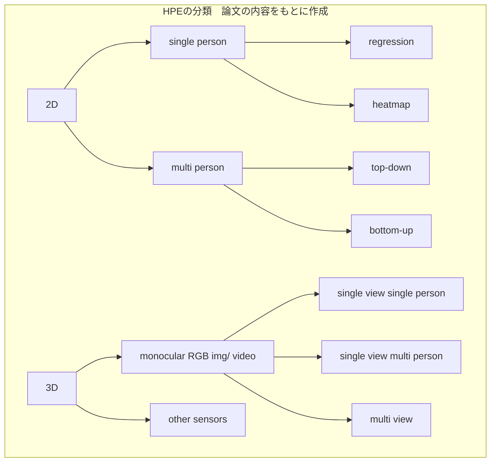

2024-08-05

「motion capture」で調べると2010年代後半の論文が見つかることが多く、最近の研究がどんな感じなのか知りたいので、総説論文を読む。

2022年までの論文をまとめている。

## Title
Deep Learning-based Human Pose Estimation: A Survey

## Author
CE ZHENG, University of Central Florida, USA
WENHAN WU, University of North Carolina at Charlotte, USA
CHEN CHEN, TAOJIANNAN YANG, and SIJIE ZHU, University of Central Florida, USA JU SHEN, University of Dayton, USA
NASSER KEHTARNAVAZ, University of Texas at Dallas, USA
MUBARAK SHAH, University of Central Florida, USA

## Motivation
conputer visionの中の2D/ 3D human pose estimationに焦点を絞り、とくにdeep learningを用いた最近までの研究をまとめる。
先行の総説論文は、deep learningを用いた手法の紹介が不十分であったり、特定の分野（3D multi-view HPE from monocular cameras and 3D HPE from other sensors）の解説が欠けていることがある。

最近のdlを用いた2D/3Dの論文をまとめることで、既存の論文の欠点を補う。
評価手法、応用、comprehensive discussionもカバーする。

## Method
- 2022年までの260本の論文
- 2D/3Dのdlに基づくHPEを以下に基づいて分類
  - 2D or 3D シナリオ
  - single-view or multi-view
  - monocular or other sensors
  - learning paradigm
- 性能を比較
  - 各手法の長所と短所についての示唆を得て、今後の研究方向をしめす。
- HPEの応用分野を解説
- key challengeについて議論

- 2D HPE
  - single person
    - regression-based
      - 入力画像から直接関節位置を推定
    - heatmap-based
      - 現在の主流
      - 
  - multi person
    - top-down
    - bottom-up

## Insights

## Cotribution Summary

## keyword
- single-view / multi view
- Log likelihood estimation
- multi task learning
  - 2D single personのregressionの手法に関連
## Unknown

## Reflection

## Reference
- heatmap-based: 2D single person HPEの主流 に関する論文
  - Xianjie Chen and Alan L. Yuille. 2014. Articulated pose estimation by a graphical model with image dependent pairwise relations. In NeurIPS.
  - 171, 231, 254
- cascaded deep neural network
  - 233(DeepPose)
  - deep poseのおかげで、HPEのパラダイムが古典的->dl、とくにCNNに変わった

